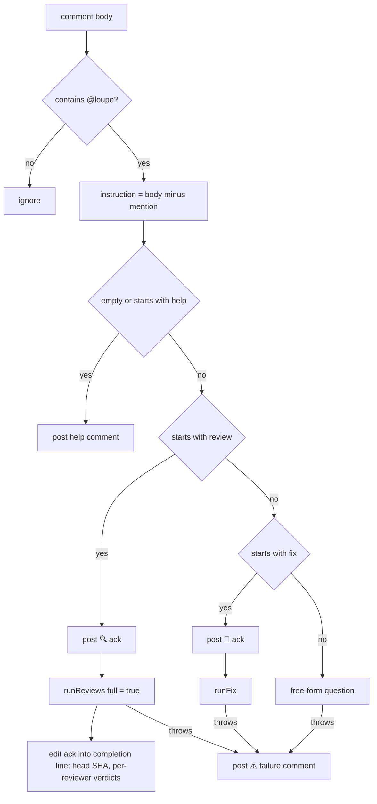

# @loupe chat


Any PR comment containing `@loupe` (case-insensitive, word boundary) starts the chat job. Review-thread comments count too. The text after the mention is the instruction.

## Dispatch



Question, help, fix, and failure replies are top-level issue comments. The review command updates its ack in place when it finishes, and the review pipeline may resolve or delete this reviewer's prior inline comments according to `priorComments`.

## `@loupe review`

Same pipeline as a push, with `full` forced. See [First run vs later runs](./first-vs-incremental.md#forced-full-run). All configured reviewers run. Each reviewer's summary comment is updated in place, so when the run finishes the "🔍 On it" ack is edited into a completion line: the head SHA, one verdict per reviewer, and a note when no changed file fell under the config's configured directories. A reviewer that fails gets its own failure comment, and the job exits nonzero.

## `@loupe <question>`

The chat job fetches the PR and its changed files, then makes one headless agent call with the question and full inline diff. The prose answer is posted as a top-level issue comment.

Headless: no tools, no checkout access, whole PR diff inlined regardless of reviewer globs. No reviewer guidance, skills, or conventions are included. The answer is prose, not JSON.

## `@loupe fix <what>`

The fix path is longer because it can write to the branch:

1. Post a “🔧 On it” acknowledgement and fetch the PR.
2. Refuse forked PRs, which the Actions token cannot push to.
3. Check out the PR head, give the agent the instruction and changed-file list, and let it edit the checkout.
4. If files changed, commit as loupe and push to the head branch; otherwise report that no changes were made.
5. Ask the user to run `@loupe review`. The token-authored push does not trigger the review workflow.

- Commit message: `loupe: <first 60 chars of instruction>`. Author `loupe <loupe@users.noreply.github.com>`.
- The push does **not** trigger a new review run. Pushes made with the Actions token do not fire `pull_request` workflows. Ask for `@loupe review` after.
- A push rejected by branch protection posts a comment saying so. The chat job needs `contents: write`.

## Failure comment

Any thrown error after the ack posts:

```
⚠️ I couldn't complete the <review|fix|answer> — <first 500 chars of error>

See the Actions run logs for details.
```

Next: [Configuration](../configuration.md) for every knob, or back to the [index](./README.md).
